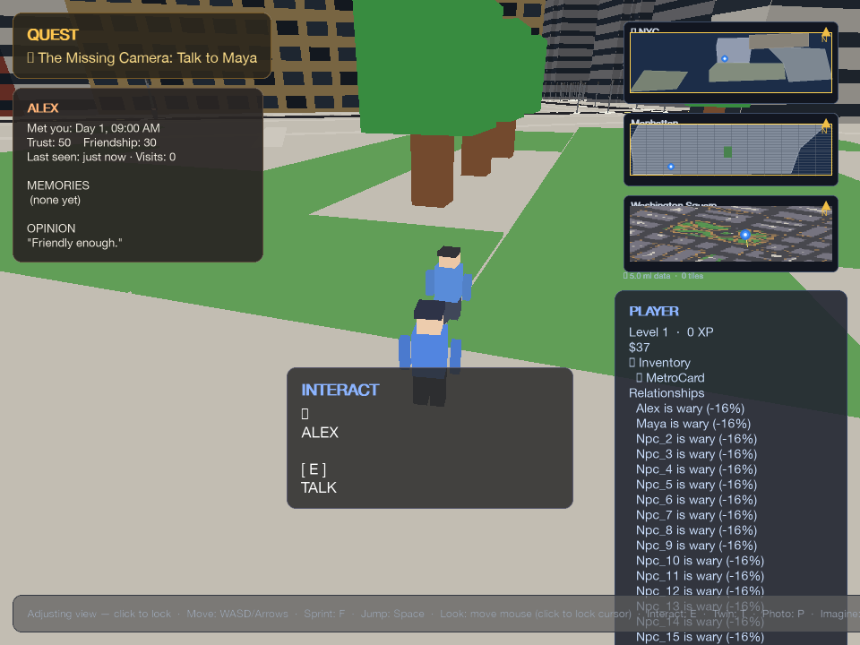
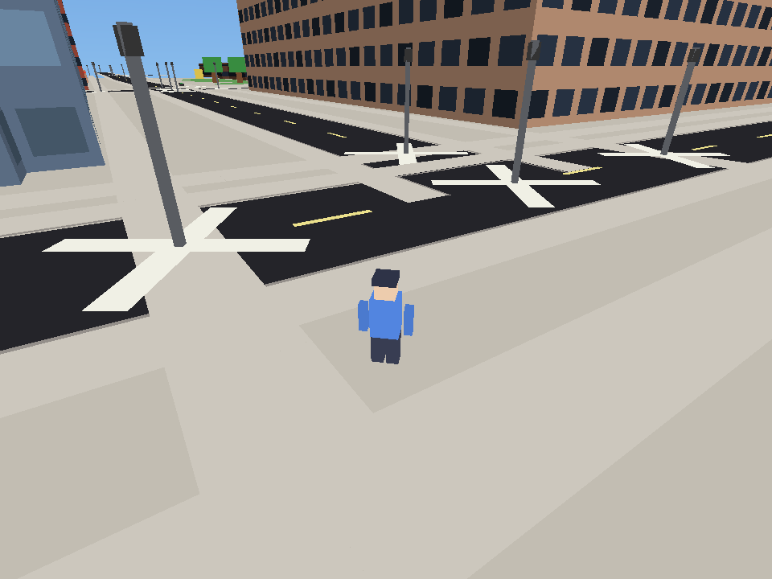
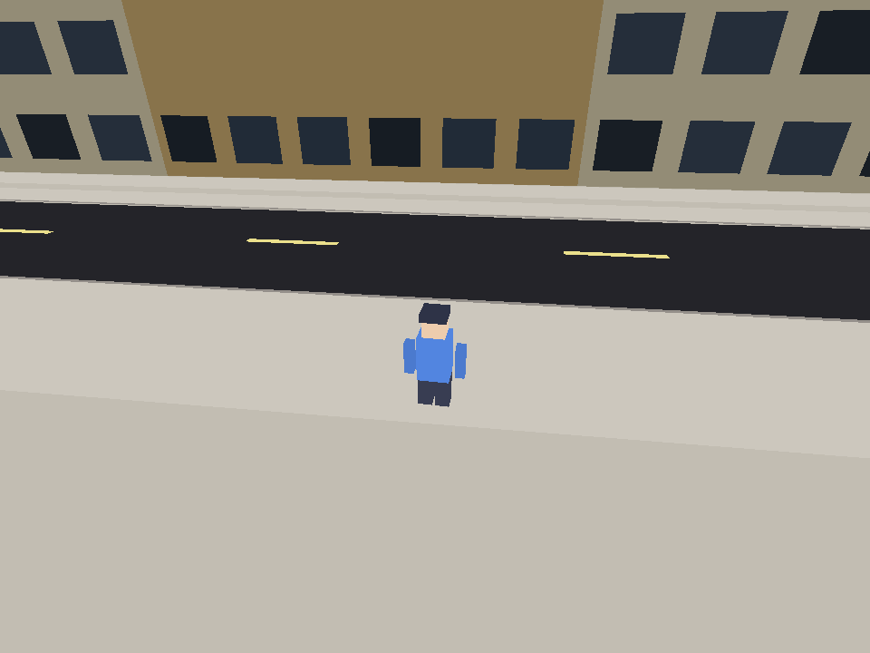

# NYC Tiny World

A walkable 3D slice of Greenwich Village: real OpenStreetMap streets and buildings, NPCs with schedules, traffic, day/night lighting, and a camera-theft quest that starts the moment you arrive.

**In the first 30 seconds:** you spawn facing Maya. She’s mid-sentence about a stolen camera. A gold marker floats over her head. Press **E**.

## Run

```bash
pip install -r requirements.txt && python3 scripts/play_3d.py
```

Map data is already in the repo. First launch is the Village at 8:00 AM, third-person, mouse-look with a click.

Controls: **WASD** walk, **F** sprint, **Space** jump, **Click** mouse look, **E** interact, **Esc** quit.

## Highlights

Buildings use OSM footprints with NYC facade colors, per-story windows, and real Wikimedia photos on named landmarks. The clock drives sky color, fog, NPC routines, and the feel of the street. Under the hood, quests, NPC minds, and a small neighborhood economy change what people remember and ask for.

## Visuals

### Gameplay

| Opening Mission | Character Interaction |
|---|---|
|  |  |
| Spawn facing Maya and the camera-theft quest. | Talk to Alex and other NPCs as the mission unfolds. |

### City Views

| NYU Street Canyon | West Village Blocks | Night Walk |
|---|---|---|
|  |  |  |
| Dense campus blocks with the new window grid. | Warmer brick and limestone palette away from spawn. | The same city under the night sky and fog pass. |

## License

Code is MIT licensed. Wikimedia facade photos are tracked in `data/facades/`
with source links in `data/facades/ATTRIBUTION.md`.

More: [docs/](docs/)
