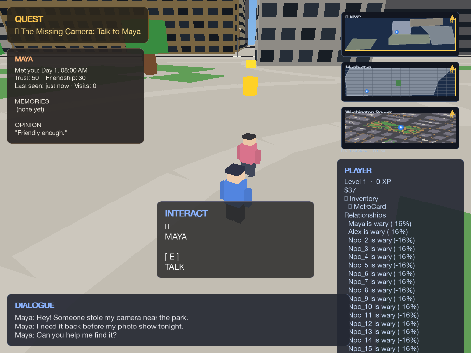
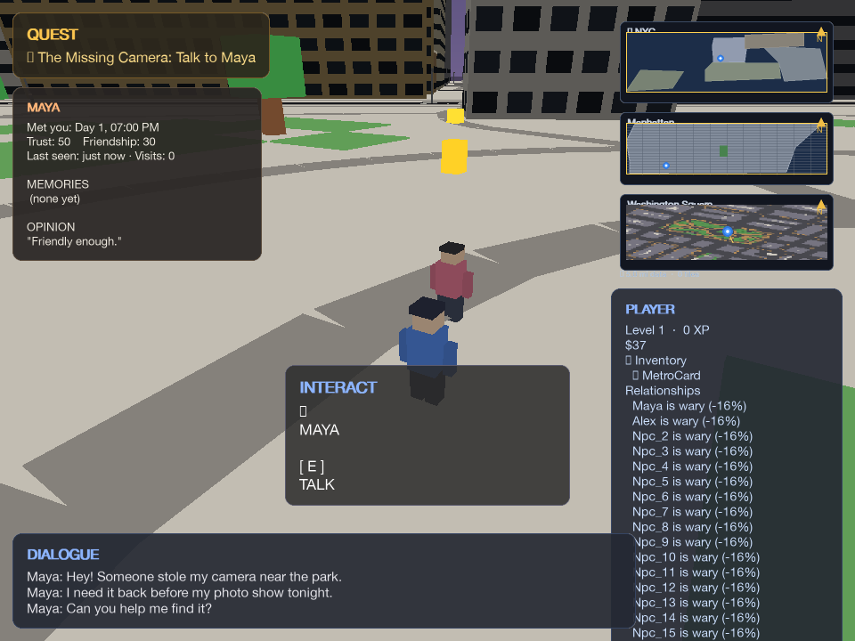
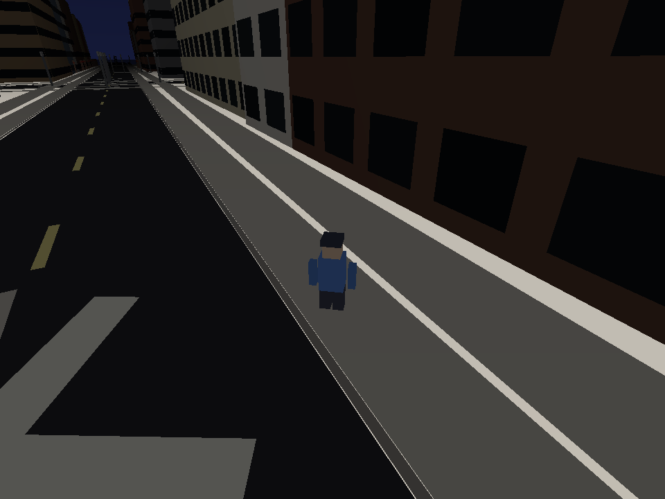

# NYC Tiny World

A walkable 3D slice of Greenwich Village — real OpenStreetMap streets and buildings, NPCs with schedules, and a camera-theft quest that starts the moment you arrive.

**In the first 30 seconds:** you spawn facing Maya. She’s mid-sentence about a stolen camera. A gold marker floats over her head. Press **E**.

## Run

```bash
pip install -r requirements.txt && python3 scripts/play_3d.py
```

Map data is already in the repo. First launch is the Village at 8:00 AM, third-person, mouse-look with a click.

| | |
|---|---|
| **WASD** | walk · **F** sprint · **Space** jump |
| **Click** | unlock / lock mouse look |
| **E** | talk, enter, pick up |
| **Esc** | quit (auto-saves) |

`python3 scripts/play_3d.py --graphics normal` draws farther. `--no-load` ignores an existing save so the opening beat plays again.

## What’s going on

Buildings are OSM footprints with NYC facade colors (brownstone, yellow brick, limestone, glass) and per-story windows. Named landmarks get real Wikimedia photos. The clock drives sky color, fog, and NPC routines. Under the hood: quests, NPC minds, and a small neighborhood economy — you feel that by talking to Maya, not by opening a menu.

## Demo

Morning opening · dusk · night:





```bash
python3 scripts/play_3d.py --no-load --screenshot docs/images/opening.png
python3 scripts/play_3d.py --no-load --hour 19 --screenshot docs/images/dusk.png
python3 scripts/play_3d.py --no-load --hour 22 --screenshot docs/images/night.png
python3 scripts/play_3d.py --bench 180
```

Record 30 seconds from spawn (Maya → cafe on MacDougal). Photo mode (**P**, then **Enter**) writes PNGs to `data/screenshots/`.

## License

Code is MIT licensed. Wikimedia facade photos are tracked in `data/facades/`
with source links in `data/facades/ATTRIBUTION.md`.

More: [docs/](docs/)

---

*Inspired by Thijs ([@tandpfun](https://github.com/tandpfun)) + his SF walkable map.*
